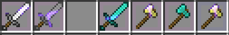

Fixes relevant axe weapons that are no longer weapons since the "foraging update" on Hypixel Skyblock
\+ some random misc changes since the "texture update" <-- stupid
## Requires [NoResourcePack](https://modrinth.com/mod/noresourcepack)
### Be sure to add a NoResourcePack whitelist to the items you want fixed

### Note: This only sets the texture target to the vanilla one, you can still use a pack that overrides the vanilla items

Relevant weapons fixed:
- Halberd of the Shredded -> Back to axe
- Daedalus blade -> Back to Axe (both fragged and unfragged)
- Ragnarock -> Back to axe
- Blaze slayer daggers -> Material fixed (they don't change material between attunements anymore)
- Katanas -> Back to diamond sword (except Voidedge, that is a minecraft:iron\_sword)
